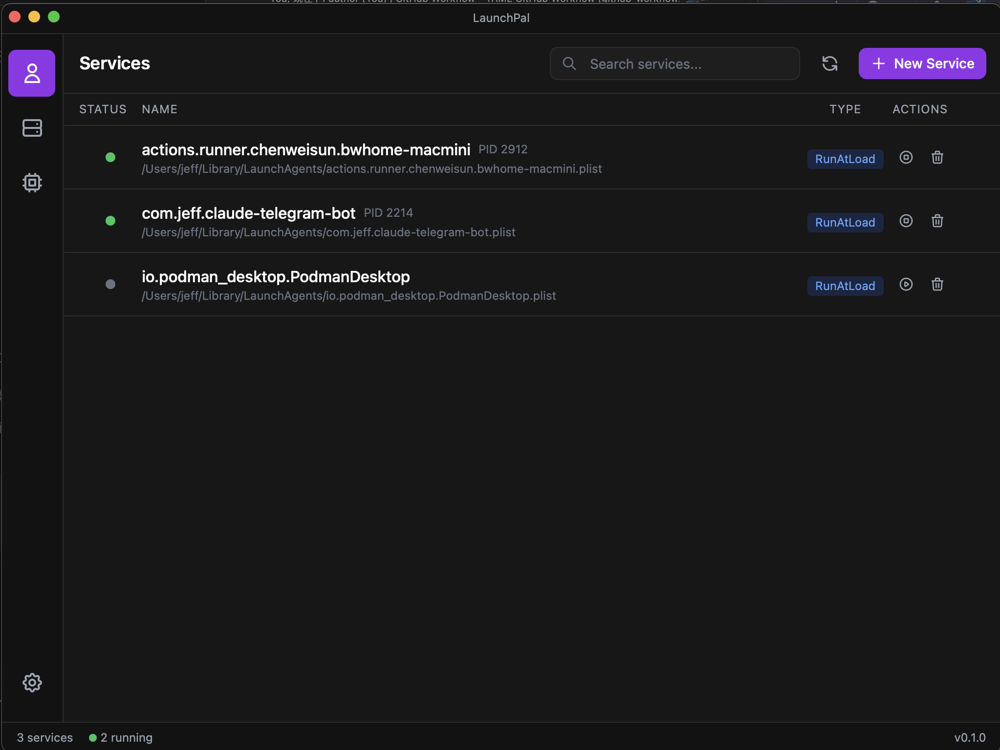
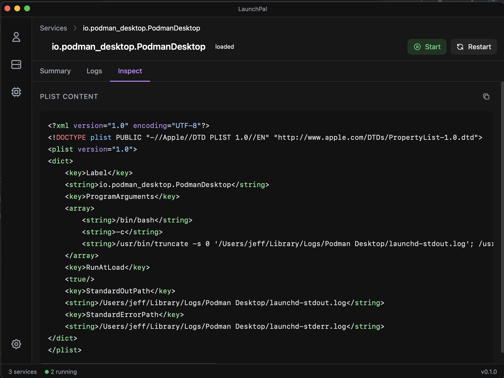
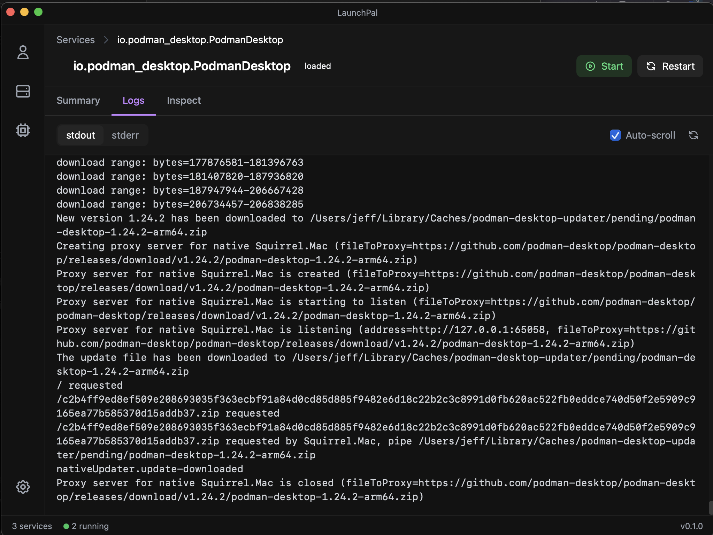

# LaunchPal

A modern GUI for managing macOS LaunchAgents.

## Features

- 🎯 Manage LaunchAgents with an intuitive interface
- 👁️ View user-level and system-level services
- 📊 View service status in real-time
- ▶️ Start/Stop user services with one click
- ⚡ Run Now (Kickstart) — start a service immediately with one click (`launchctl kickstart -k`)
- 📋 View service logs (stdout/stderr) with ANSI color rendering (16-color SGR sequences are shown as colored text instead of raw `[31m` escape codes); services without a configured log path or a not-yet-created log file show a clear placeholder instead of a generic error
- 🧹 Clear stdout / stderr logs from the Logs tab (one-click in-place truncate; system daemons fall back to the privileged helper only when the file is not user-writable)
- 🔄 Auto-refresh the Logs tab (`tail -f`-style): an optional toggle reloads the current stream every 2 seconds; it turns itself off when a load has no path, is not found, or fails, and stays independent of Auto-scroll
- ➕ Create and configure new services
- ⏰ Schedule services with Calendar Interval or Fixed Interval
- 📅 Cron-style range (`9-17`) and enumeration (`1,3,5`) syntax with automatic expansion
- 🌐 Configure environment variables for services
- ✏️ Edit existing service configurations
- 🧬 Preserve advanced launchd keys on edit — keys LaunchPal has no UI for (e.g. `ProcessType`, `Nice`, `MachServices`, `Sockets`, resource limits) are kept verbatim when you update a service, instead of being dropped
- 🔍 Browse system services (read-only) with heuristic status detection (no elevation required); ambiguous matches are flagged with an info icon
- 🔐 **Admin Mode** — manage `/Library/LaunchDaemons` system services with a single authorization per session (no persistent root process; helper exits when LaunchPal does)
- 📄 Inspect plist files with syntax highlighting
- 📂 Reveal plist files in Finder with one click
- 💾 Automatic backup before modifications
- 🔍 Side-by-side diff preview before restoring a backup (binary plists are auto-converted to XML)

## Screenshots

### Main Interface
<p align="center">
  
</p>

### System Services
<p align="center">
  
</p>

### Service Logs
<p align="center">
  
</p>

### Plist Inspector
<p align="center">
  
</p>

## Installation

### Homebrew (Recommended)

```bash
brew install --cask chenwei791129/apps/launchpal
```

Or add the tap first:

```bash
brew tap chenwei791129/apps
brew install --cask launchpal
```

> **Note:** LaunchPal is not code-signed. The quarantine attribute is automatically removed during Homebrew installation so macOS Gatekeeper will not block the app.

### Download

Download the latest release from the [Releases](https://github.com/chenwei791129/launchpal/releases) page.

### IMPORTANT: Unsigned Application

LaunchPal is currently **not signed with an Apple Developer certificate**. macOS will block unsigned applications from running by default.

After downloading the `.dmg` file, open it and drag **LaunchPal.app** to the **Applications** folder. Then remove the quarantine attribute before running it:

```bash
xattr -dr com.apple.quarantine /Applications/launchpal.app
```

Alternatively, you can try right-clicking the app and selecting "Open" from the context menu, which may prompt you to allow the unsigned app to run.

### Building from Source

If you prefer to build from source:

```bash
# Clone the repository
git clone https://github.com/chenwei791129/launchpal.git
cd launchpal

# Install dependencies
make setup

# Build the application
make build

# The app will be in build/bin/launchpal.app
```

## Admin Mode

LaunchPal can manage system services under `/Library/LaunchDaemons` via an optional **Admin Mode**:

1. Open **Settings** → **Admin Mode** → **Enable Admin Mode**.
2. macOS prompts once for your password (or Touch ID) and launches a root-privileged helper process.
3. While Admin Mode is enabled, the **System Services** page lets you Start / Stop / Restart / Edit / Delete / Create daemons.
4. Click **Disable Admin Mode** (or quit LaunchPal) to stop the helper — nothing persists on the system.

**Why session-scoped?** LaunchPal is unsigned and cannot register a persistent privileged helper. The session-scoped model trades "enter your password once per launch" for "no root daemon lingers on your machine after LaunchPal exits". The helper exits automatically if LaunchPal crashes or is force-quit (parent PID watchdog, 2-second response time).

**Scope of Admin Mode writes**: only `/Library/LaunchDaemons/`. `/System/Library/LaunchDaemons/` remains read-only under Admin Mode (SIP would reject writes anyway).

## Known Limitations

- User services (`~/Library/LaunchAgents`) can be managed without authorization.
- System services (`/Library/LaunchDaemons`) require Admin Mode; authorization is prompted **once per LaunchPal session** and not cached across sessions (by design — no persistent root daemon).
- Apple system services (`/System/Library/LaunchDaemons`) are always read-only.
- Some system services may require Full Disk Access permission to view.
- Editing a system daemon requires LaunchPal to read its existing plist to preserve advanced (unmodeled) keys; without Full Disk Access that read fails and the edit falls back to writing only the keys shown in the form.
- A `Disabled` key in a service plist is preserved on edit (LaunchPal does not model it), so editing a disabled service keeps it disabled. There is no in-app control to clear `Disabled`; use `launchctl enable` to re-enable such a service.

## License

MIT License - see [LICENSE](LICENSE) file for details.

## Star History

<a href="https://www.star-history.com/?repos=chenwei791129%2Flaunchpal&type=date&legend=top-left">
 <picture>
   <source media="(prefers-color-scheme: dark)" srcset="https://api.star-history.com/chart?repos=chenwei791129/launchpal&type=date&theme=dark&legend=top-left" />
   <source media="(prefers-color-scheme: light)" srcset="https://api.star-history.com/chart?repos=chenwei791129/launchpal&type=date&legend=top-left" />
   
 </picture>
</a>
